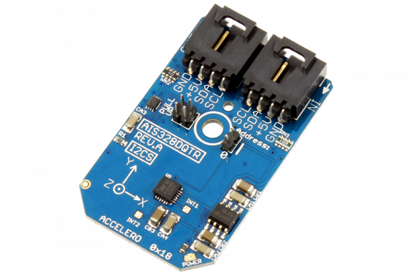

[](https://store.ncd.io/product/ais328dqtr-high-performance-ultra-low-power-3-axis-accelerometer-with-digital-output-for-automotive-applications-i2c-mini-module/).

# AIS328DQTR

The AIS328DQ, manufactured by STMicroelectronics, is an ultra-low power high performance 3-axis linear accelerometer with an I2C interface.The AIS328DQ has dynamic user-selectable full-scales of ±2g/±4g/±8g and is capable of measuring accelerations with output data rates from 0.5 Hz to 1 kHz.
This Device is available from www.ncd.io

[SKU: AIS328DQTR]

(https://store.ncd.io/product/ais328dqtr-high-performance-ultra-low-power-3-axis-accelerometer-with-digital-output-for-automotive-applications-i2c-mini-module/)
This Sample code can be used with Raspberry Pi.

Hardware needed to interface AIS328DQTR 3Axis Accelometer With Raspberry Pi :

1. <a href="https://store.ncd.io/product/ais328dqtr-high-performance-ultra-low-power-3-axis-accelerometer-with-digital-output-for-automotive-applications-i2c-mini-module/">AIS328DQTR Ultra Low Power 3Axis Accelometer Sensor</a>

2. <a href="https://store.ncd.io/product/i2c-shield-for-raspberry-pi-3-pi2-with-outward-facing-i2c-port-terminates-over-hdmi-port/">Raspberry Pi I2C Shield</a>

3. <a href="https://store.ncd.io/product/i%C2%B2c-cable/">I2C Cable</a>

## Python

Download and install smbus library on Raspberry pi. Steps to install smbus are provided at:

https://pypi.python.org/pypi/smbus-cffi/0.5.1

Download (or git pull) the code in pi. Run the program.

```cpp
$> python AIS328DQTR.py
```
The lib is a sample library, you will need to calibrate the sensor according to your application requirement.
